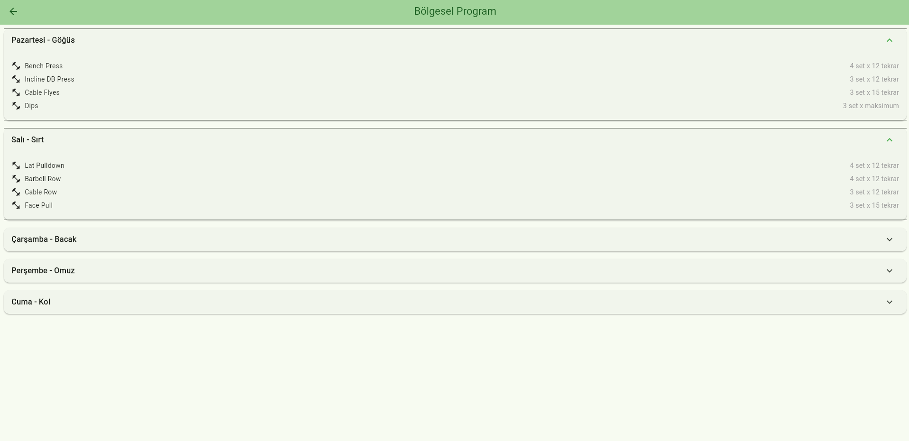

# Sağlıklı Yaşam ve Spor Takip Uygulaması

## Proje Amacı
Bu uygulama, kullanıcıların sağlıklı yaşam hedeflerine ulaşmalarına yardımcı olmak için tasarlanmış bir fitness ve beslenme takip uygulamasıdır.

## Uygulama Ekranları

### 1. Giriş Ekranı

- Kullanıcı girişi ve kayıt işlemleri
- E-posta ve şifre doğrulama

### 2. Ana Ekran

- Program seçimi
- Hızlı başlangıç
- Günlük aktivite takibi

### 3. Antrenman Ekranı

- Program detayları
- Egzersiz listesi
- Set ve tekrar takibi

### 4. Beslenme Ekranı

- Öğün takibi
- Kalori hesaplama
- Besin değerleri

### 5. Profil Ekranı

- Kullanıcı bilgileri
- İstatistikler
- Hedef takibi

## Özellikler

### 🏋️‍♂️ Antrenman Programları
- Full Body Programı
- Push/Pull/Legs
- Bölgesel Program
- Ev Programı

### 🥗 Beslenme Takibi
- Öğün planlama
- Kalori hesaplama
- Besin değerleri veritabanı

### 📊 Profil ve İstatistikler
- Kişisel bilgiler
- İlerleme grafikleri
- Hedef belirleme

## Kurulum

1. Gereksinimleri yükleyin:
   - Flutter SDK
   - Android Studio/VS Code

2. Projeyi klonlayın:
