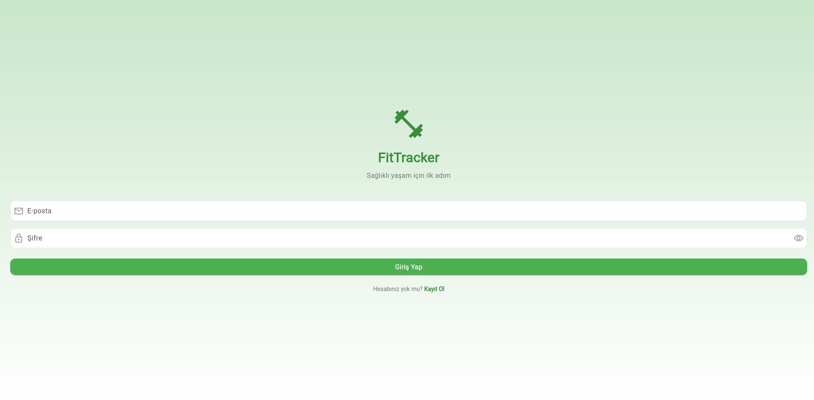
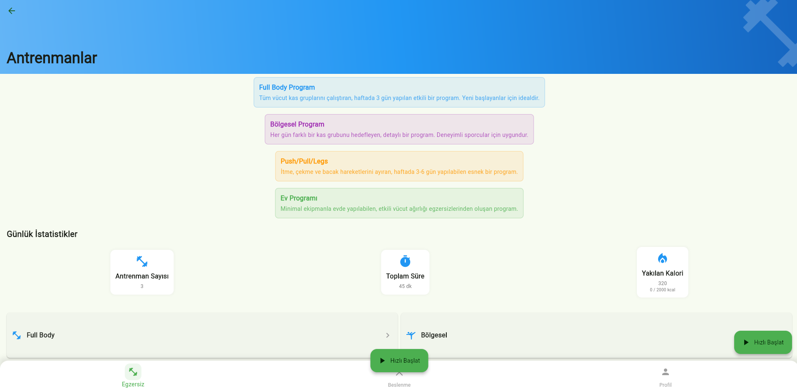
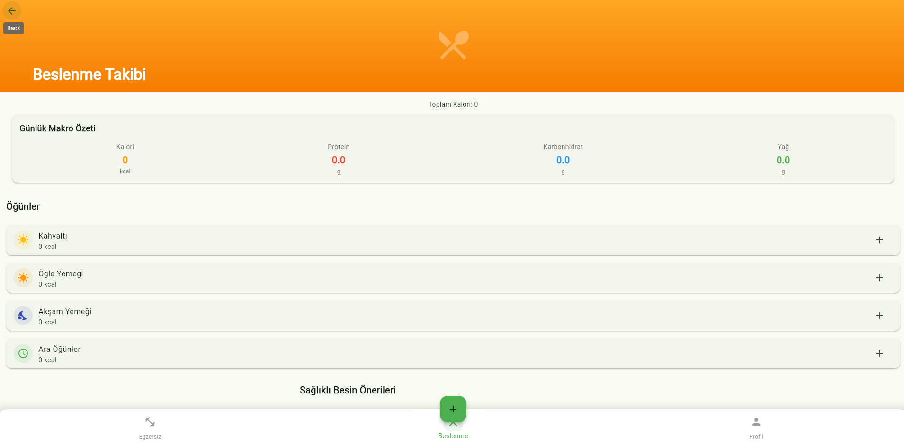
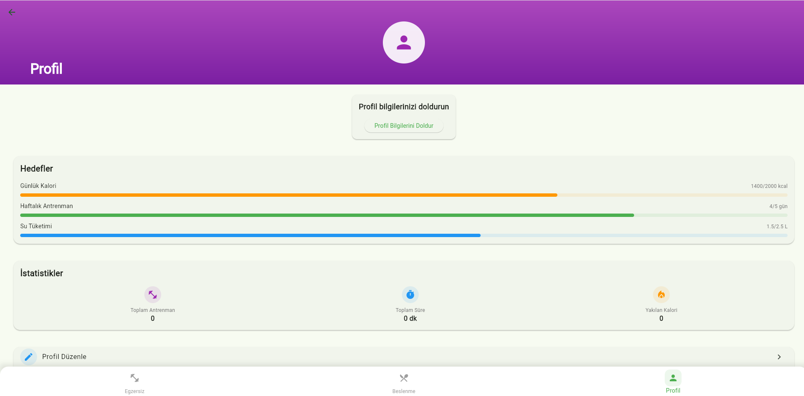

# Sağlıklı Yaşam ve Spor Takip Uygulaması

## Ekip Üyeleri
- FURKAN AKDEMİR - 132230044

## Proje Tanıtım Videosu
[](https://www.youtube.com/watch?v=VIDEO_ID)

## Proje Amacı
Bu uygulama, kullanıcıların sağlıklı yaşam hedeflerine ulaşmalarına yardımcı olmak için tasarlanmış bir fitness ve beslenme takip uygulamasıdır. Kullanıcılar antrenman programlarını takip edebilir, beslenme alışkanlıklarını düzenleyebilir ve gelişimlerini izleyebilirler.

## Kullanılan Teknolojiler
- Flutter
- Dart
- SQLite

## Uygulama Özellikleri

### 🏋️‍♂️ Antrenman Programları
- Full Body Programı
- Push/Pull/Legs
- Bölgesel Program
- Ev Programı

### 🥗 Beslenme Takibi
- Öğün planlama
- Kalori hesaplama
- Besin değerleri veritabanı

### 📊 Profil ve İstatistikler
- Kişisel bilgiler
- İlerleme grafikleri
- Hedef belirleme

## Veritabanı Yapısı
[Veritabanı şeması ve açıklamasını buraya ekleyin]

## Ekran Görüntüleri

### Giriş Ekranı

- Kullanıcı girişi ve kayıt işlemleri
- E-posta ve şifre doğrulama

### Ana Ekran

- Program seçimi
- Hızlı başlangıç
- Günlük aktivite takibi

### Antrenman Ekranı

- Program detayları
- Egzersiz listesi
- Set ve tekrar takibi

### Beslenme Ekranı

- Öğün takibi
- Kalori hesaplama
- Besin değerleri

### Profil Ekranı

- Kullanıcı bilgileri
- İstatistikler
- Hedef takibi

## Kurulum
1. Gereksinimleri yükleyin:
   - Flutter SDK
   - Android Studio/VS Code
2. Projeyi klonlayın:
   ```bash
   git clone https://github.com/furkanak47/Mobil_proje_gym_takip.git
   ```
3. Bağımlılıkları yükleyin:
   ```bash
   flutter pub get
   ```
4. Uygulamayı çalıştırın:
   ```bash
   flutter run
   ```
